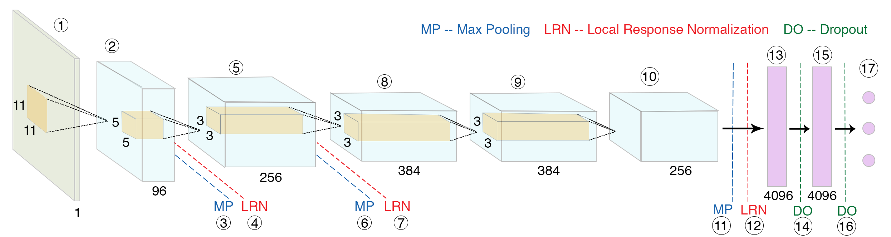

.. GaMorNet documentation master file, created by
   sphinx-quickstart on Tue May  5 19:36:48 2020.
   You can adapt this file completely to your liking, but it should at least
   contain the root `toctree` directive.

.. _about_gamornet:

About GaMorNet
==============
The Galaxy Morphology Network (GaMorNet) is a convolutional neural network that can classify galaxies as being disk-dominated, bulge-dominated or indeterminate based on their bulge to total light ratio. GaMorNet doesn't need a large amount of training data and can work across different data-sets. For more details about GaMorNet's design, how it was trained etc., please refer to :ref:`pub_and_other_data`.  

   Schematic diagram of Galaxy Morphology Network.

.. _first_contact:

First contact with GaMorNet
---------------------------
GaMorNet's user-faced functions have been written in a way so that it's easy to start using them even if you have not dealt with convolutional neural networks before. For. eg. to perform predictions on an array of SDSS images using our trained models, the following line of code is all you need. 

.. code-block:: python

   from gamornet.keras_module import gamornet_predict_keras

   preds = gamornet_predict_keras(img_array, model_load_path='SDSS_tl', input_shape='SDSS')

In order to start using GaMorNet, please first look at the :ref:`getting_started` section for instructions on how to install GaMorNet. Thereafter, we recommend trying out the :ref:`tutorials` in order to get a handle on how to use GaMorNet. 

Finally, you should have a look at the :ref:`usage_guide` for our recommendations on how to use different elements of GaMorNet's public data release for your own work and the :ref:`api_docs` for detailed documentation of the different functions in the module. 

.. _pub_and_other_data:

Publication & Other Data
------------------------
You can look at this `ApJ paper <https://doi.org/10.3847/1538-4357/ab8a47>`_ to learn the details about GaMorNet's architecture, how it was trained, and other details not mentioned in this documentation. 

We strongly suggest you read the above-mentioned publication if you are going to use our trained models for performing predictions or as the starting point for training your own models.

All the different elements of the public data release (including the new Keras models) are summarized in :ref:`usage_guide`.

Attribution Info.
^^^^^^^^^^^^^^^^^^^
Please cite the above mentioned publication if you make use of this software module or some code herein.

.. code-block:: tex

    @article{Ghosh2020,
      doi = {10.3847/1538-4357/ab8a47},
      url = {https://doi.org/10.3847/1538-4357/ab8a47},
      year = {2020},
      month = jun,
      publisher = {American Astronomical Society},
      volume = {895},
      number = {2},
      pages = {112},
      author = {Aritra Ghosh and C. Megan Urry and Zhengdong Wang and Kevin Schawinski and Dennis Turp and Meredith C. Powell},
      title = {Galaxy Morphology Network: A Convolutional Neural Network Used to Study Morphology and Quenching in $\sim$100, 000 {SDSS} and $\sim$20, 000 {CANDELS} Galaxies},
      journal = {The Astrophysical Journal}
    }

Additionally, if you want, please include the following text in the Software/Acknowledgment section.

.. code-block:: tex

    This work uses trained models/software made available as a part of the Galaxy Morphology Network public data release. 

License
^^^^^^^^
|copyright|

Developed by `Aritra Ghosh <http://ghosharitra.com>`_ and made available under a `GNU GPL v3.0 <https://github.com/aritraghsh09/GaMorNet/blob/master/LICENSE>`_ license. 

.. _getting_help:

Getting Help/Contributing
--------------------------
If you have a question, please first have a look at the :ref:`faq` section. If your question is not answered there, please send me an e-mail at this ``aritraghsh09+gamornet@xxxxx.com`` GMail address.

If you have spotted a bug in the code/documentation or you want to propose a new feature, please feel free to open an issue/a pull request on `GitHub <https://github.com/aritraghsh09/GaMorNet>`_

.. toctree::
   :maxdepth: 2
   :hidden:

   self
   getting_started
   tutorials
   usage_guide
   api_docs
   faq

